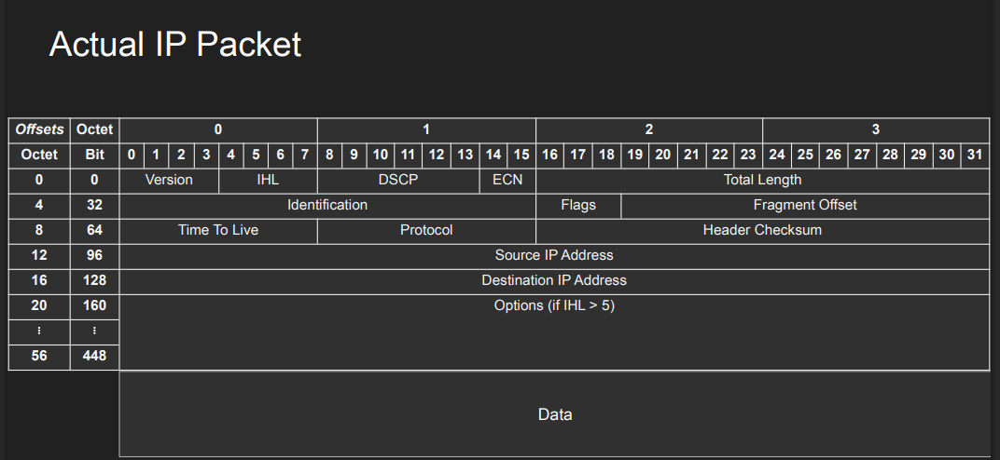

# Internet protocol (IP)

## **Version (4 bits)**

- Indicates the IP version being used (IPv4 = 4, IPv6 = 6)
- Helps routers determine how to process the packet

## **Header Length (IHL) (4 bits)**

- Specifies the length of the IP header in 32-bit words
- Minimum value is 5 (20 bytes), maximum is 15 (60 bytes)
- Default header length is 20 bytes (5)
- So Option field maximum length is 40 bytes

### **DSCP (Differentiated Services Code Point, 6 bits)**

- Used for Quality of Service (QoS) by prioritizing packets (e.g., voice over email)
- Allows routers to classify and manage network traffic efficiently

### **ECN (Explicit Congestion Notification, 2 bits)**

- Used to signal network congestion without dropping packets
- Enables end-to-end notification of network congestion in IP networks

## **Total Length (16 bits)**

- Specifies the total length of the IP packet (header + data)
- Maximum value is 65,535 bytes
- Minimum is 20 bytes (header only)

## **Identification (16 bits)**

- Unique identifier for a group of fragments of a single IP datagram
- Used when a packet is fragmented across multiple smaller packets

## **Flags (3 bits)**

- **Bit 0**: Reserved (must be 0)
- **Bit 1**: Don't Fragment (DF) - prevents fragmentation
- **Bit 2**: More Fragments (MF) - indicates more fragments follow

## **Fragment Offset (13 bits)**

- Indicates where this fragment belongs in the original unfragmented packet
- Measured in 8-byte units
- Helps reassemble fragmented packets at destination

## **Time to Live (TTL) (8 bits)**

- Prevents packets from looping infinitely in the network
- Decremented by 1 at each router hop
- Packet is discarded when TTL reaches 0

## **Protocol (8 bits)**

- Identifies the next-level protocol (TCP = 6, UDP = 17, ICMP = 1)
- Tells the receiving system how to process the data portion

## **Header Checksum (16 bits)**

- Error detection for the header only (not the data)

## **Source IP Address (32 bits)**

- IP address of the sender
- Used for routing responses back to the originator

## **Destination IP Address (32 bits)**

- IP address of the intended recipient
- Used by routers to determine forwarding path

## **Options (Variable length, 0-40 bytes)**

- Optional fields for special processing
- Examples: Record Route, Source Route, Timestamp

---

 

😀 Packets need to get fragmented if it doesn't fit the MTU (Maximum Transmission Unit) of the network.
