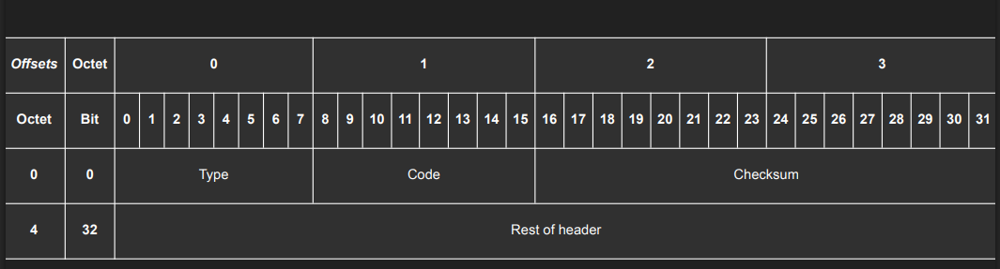
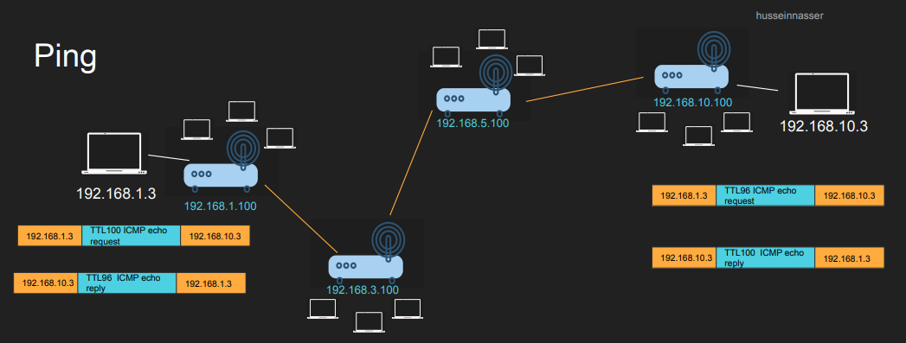
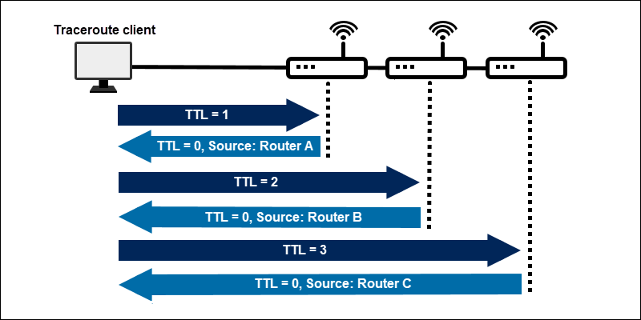

# Internet Control Message Protocol (ICMP)

## 🛑 ICMP headers are in the ip packets's data part

## 🛑 This is a network layer protocol not a transport layer protocol

## 🛑 TCP and UDP are transport layer (L4); ICMP is network layer (L3). ICMP uses IP’s Protocol field because it’s carried inside IP packets

## Designed for information messages

- **Host Unreachable**
- **Network Unreachable**
- **Port Unreachable**
- **Time Exceeded**
  - **TTL Exceeded**
  - **Fragment Reassembly Time Exceeded**
- **Echo Request**
- **Echo Reply**

## ICMP usages

### ping

### traceroute

