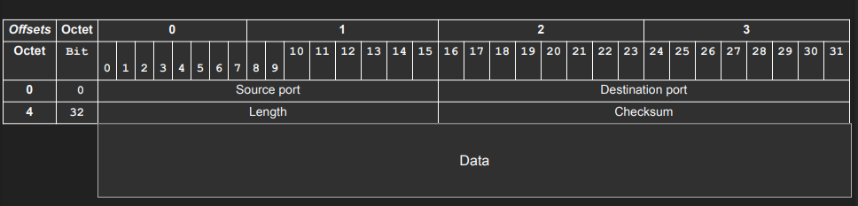

# UDP - User Datagram Protocol

## Address multiple applications on a single host using ports

### Simple protocol for sending and receiving datagrams

### 8 bytes header

### use-cases

- **DNS**
- **Video Streaming**
- **VPN**

### multiplexing and demultiplexing
