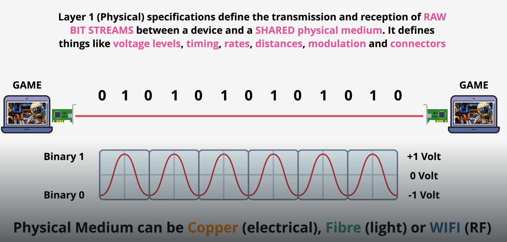
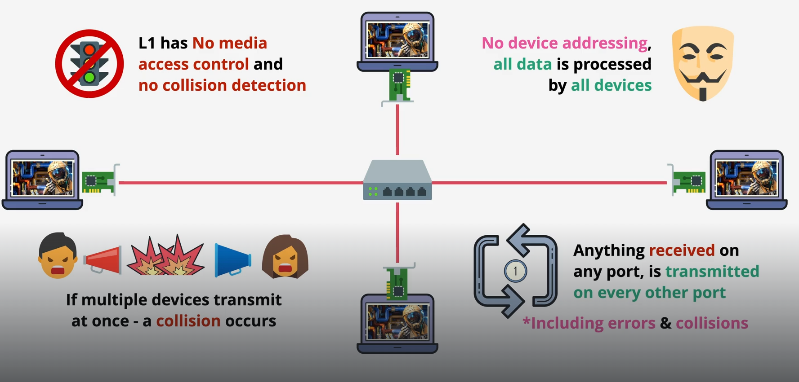

# Layer 1 (Physical Layer)

- Layer 1 takes binary data (1s and 0s) and converts them into a physical signal that can travel across a medium, then converts them back at the other end. That's it — no intelligence, no addressing, no error checking. Just signal.

- The three signal types
  - Electrical — used by copper cables (Ethernet). A 1 might be +5V, a 0 might be 0V. The specific voltages are part of the Layer 1 standard.
  - Light — used by fibre optic cables. A 1 is a pulse of light, a 0 is no light (or a different wavelength). Extremely fast and can travel very long distances.
  - Radio waves — used by Wi-Fi, Bluetooth, 4G/5G. Bits are encoded by modulating the frequency or amplitude of radio waves.

Real-world devices at Layer 1

- Hubs — repeat signals to all ports (no intelligence)
- Repeaters — boost weak signals over long cables
- Cables & connectors — the physical medium itself
- Network interface cards (NICs) — the hardware that converts digital data to signals

