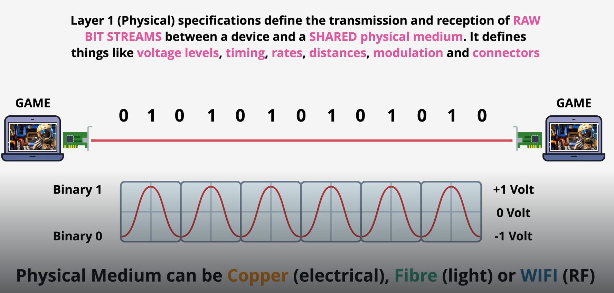
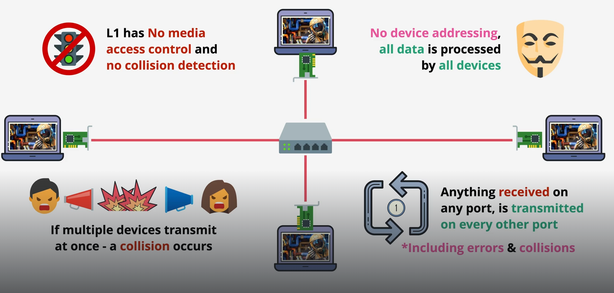

# Layer 1 (Physical Layer)

- Layer 1 takes binary data (1s and 0s) and converts them into a physical signal that can travel across a medium, then converts them back at the other end. That's it — no intelligence, no addressing, no error checking. Just signal.

- The three signal types
  - Electrical — used by copper cables (Ethernet). A 1 might be +5V, a 0 might be 0V. The specific voltages are part of the Layer 1 standard.
  - Light — used by fibre optic cables. A 1 is a pulse of light, a 0 is no light (or a different wavelength). Extremely fast and can travel very long distances.
  - Radio waves — used by Wi-Fi, Bluetooth, 4G/5G. Bits are encoded by modulating the frequency or amplitude of radio waves.

Real-world devices at Layer 1

- Hubs — repeat signals to all ports (no intelligence)
- Repeaters — boost weak signals over long cables
- Cables & connectors — the physical medium itself
- Network interface cards (NICs) — the hardware that converts digital data to signals

---

## Limitations of Layer 1

1. No Intelligence / No Addressing

Layer 1 has zero awareness of where data is going. It simply transmits bits — it has no concept of source, destination, or device identity. A hub (Layer 1 device) blindly sends every signal out of every port with no filtering whatsoever.

2. No Error Detection or Correction

Layer 1 cannot detect if a bit was corrupted, lost, or flipped during transmission. If electrical interference changes a 1 to a 0, Layer 1 has no way to know or fix it. Error detection is handled by Layer 2 (CRC in frames) and above.

3. Collisions (Shared Medium)

On shared physical media (like old coaxial Ethernet or hubs), when two devices transmit simultaneously the signals collide and corrupt each other. Layer 1 has no mechanism to prevent or resolve this — that's why CSMA/CD was needed at Layer 2, and why switches replaced hubs.
