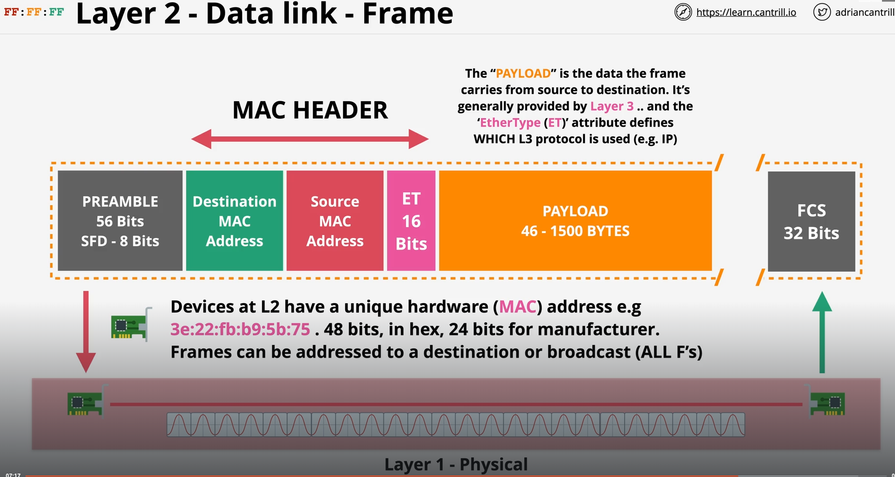
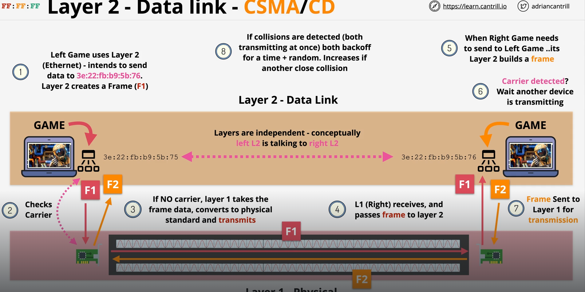
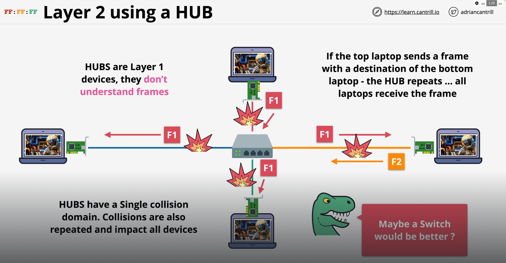
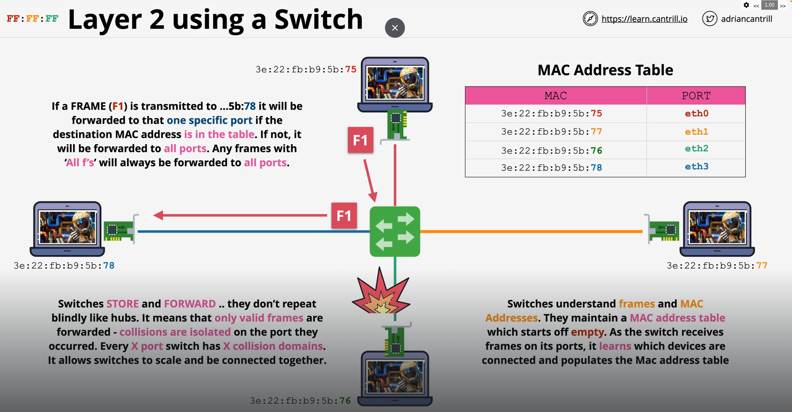

# Layer 2

- It sits just above the physical layer and does two big jobs: getting data reliably from one device to the next device on the same network, and controlling who gets to use the shared wire at any given moment.

## What Layer 2 does

It takes raw bits from Layer 1 and gives them meaning — packaging them into frames with a clear source, destination, and error check. Where Layer 3 (IP) handles routing across the whole internet, `Layer 2 only cares about the next hop — the immediate neighbour on the same` network.

## MAC Addresses

Every network interface has a burned-in 48-bit MAC address (like AA:BB:CC:DD:EE:FF). The first 3 bytes identify the manufacturer (the OUI), the last 3 are a unique device serial. Unlike IP addresses, MACs don't change when you move networks — they're tied to the hardware.

## The switch (the key Layer 2 device)

A switch learns which device is on which port by watching incoming frames. When PC-A sends a frame, the switch reads the source MAC, records "AA:AA:... is on port 1", then looks up the destination MAC to decide where to send it — not flooding everyone, just the right port. If it doesn't know the destination yet, it does flood (sends to all ports) and learns from the reply. Ports means in here the physical connections on the switch, not IP ports.

## Error detection with FCS

The Frame Check Sequence at the end of every Ethernet frame is a CRC checksum. The receiver recalculates it — if it doesn't match, the frame is silently dropped. Layer 2 detects errors but doesn't correct them; that's left to higher layers.

## Key protocols at Layer 2

Ethernet (wired), Wi-Fi / 802.11 (wireless), VLANs (802.1Q), STP (Spanning Tree Protocol to prevent loops), and ARP (which bridges Layer 2 and 3 by mapping IP addresses to MACs).

- Carrier Sense — before transmitting, a device listens to the wire. If it hears activity (a "carrier"), it waits. This alone cuts collisions dramatically.
- Multiple Access — acknowledges that many devices share the same medium. There's no central controller; everyone follows the same rules.
- Collision Detection — while transmitting, a device keeps listening. If it hears a signal that isn't its own, it knows a collision has happened. It immediately stops sending and broadcasts a 32-bit jam signal to make sure every device on the network hears about the collision.
- Random backoff (BEB) — after a collision, both devices wait a random amount of time before retrying. This randomness is what actually resolves the deadlock — if they both waited the same fixed time, they'd collide again forever. The algorithm is called Binary Exponential Backoff: after the 1st collision, pick a random wait from {0, 1} slots; after the 2nd collision, from {0, 1, 2, 3} slots; after the 3rd, from {0..7} — the window doubles each time. After 16 failed attempts the frame is dropped.

### Why modern switches mostly eliminated this problem

CSMA/CD is the answer for a shared bus or a hub. But a modern Ethernet switch gives every device its own dedicated full-duplex link — there's no shared wire anymore. Each port gets its own private collision domain, so two devices can transmit and receive simultaneously without ever conflicting. CSMA/CD still exists in the standard, but in practice it almost never fires on a switched network.

#### Hub

one big collision domain. A hub is a dumb repeater: whatever arrives on any port gets blasted out every other port. All four devices share the same wire electrically. If A and C both transmit at the same moment, they collide. Everyone on the hub has to take turns using CSMA/CD.

#### Switch

one collision domain per port. A switch doesn't repeat blindly — it buffers the frame, reads the destination MAC, and forwards it only to the right port. The link between PC-E and the switch is private to just those two. PC-E and PC-G can transmit simultaneously with zero chance of collision because they're on separate segments. Each port is its own isolated collision domain.
A useful rule of thumb:

- Every hub port added to a network → stays in the same collision domain
- Every switch port → creates a new, isolated collision domain

### But on the PC side, ARP is what fills in that destination MAC before the frame is even created. The switch only handles forwarding after the frame arrives.
