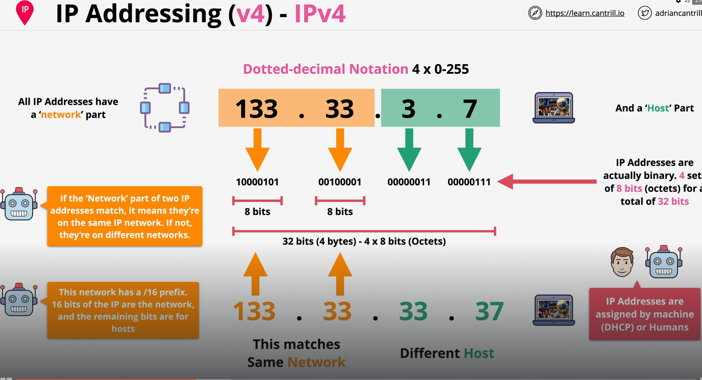
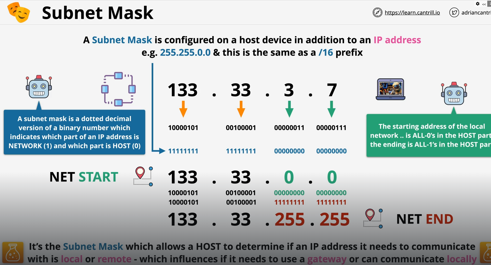
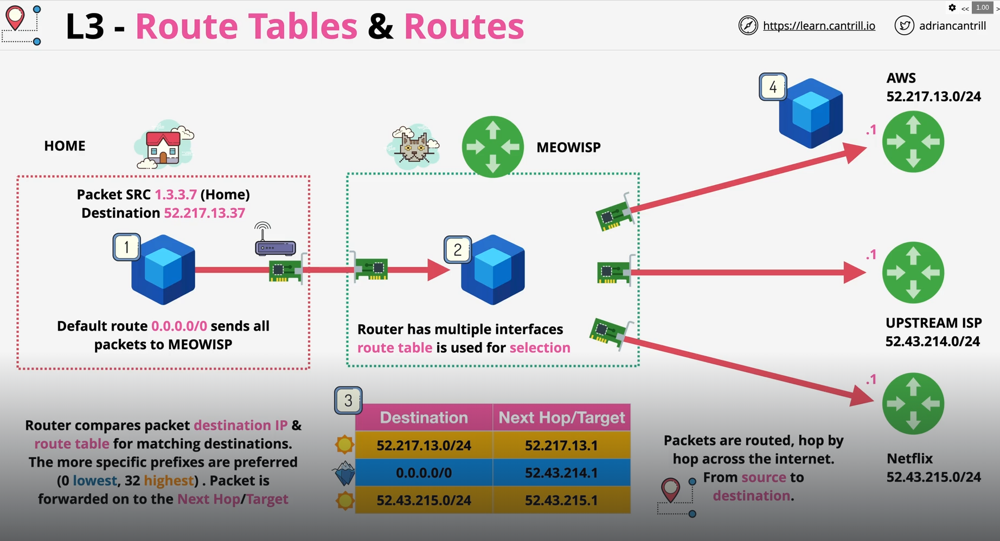
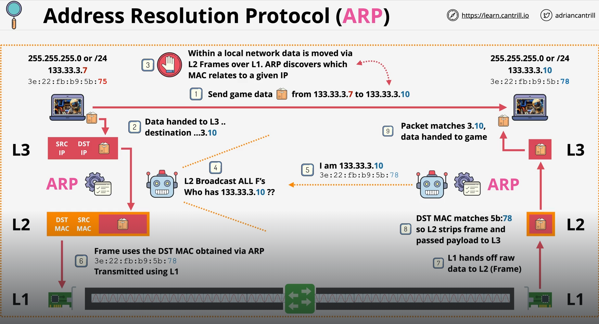
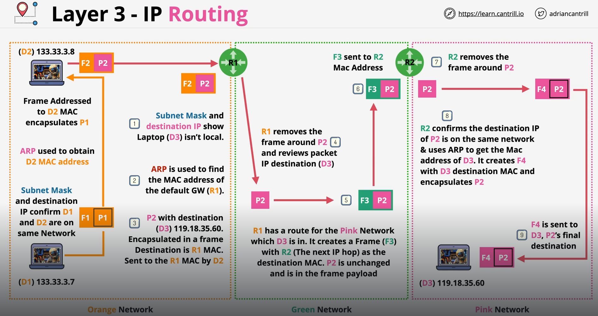

# Layer 3

## Layer 3 Protocols

- **IP**: Internet Protocol, the most common Layer 3 protocol. It provides logical addressing (IP addresses) and routing of packets across networks.
- **ICMP**: Internet Control Message Protocol, used for error messages and operational information (e.g., ping).
- **ARP**: Address Resolution Protocol, used to map IP addresses to

### Different IP Protocols

- **IPv4**: The most widely used version of IP, using 32-bit addresses.
- **IPv6**: The newer version of IP, using 128-bit addresses to accommodate the growing number of devices on the internet.

### 🛑 Layer 2 frame header gets dropped and recreated at every hop, while the Layer 3 packet header stays mostly intact.

---

## Address Resolution Protocol (ARP)

When a device wants to send data, it knows the destination IP (Layer 3), but to actually deliver the frame on the local network it needs the destination MAC address (Layer 2). ARP resolves this gap.

- 🛑 ARP only works within the same subnet. When PC A wants to reach a device on another network, it sends an ARP request for the router's MAC address (default gateway), not the remote device. The router then handles getting the packet to the other network — using its own ARP for the next hop.

- 🛑 Every physical port on a router usually has its own unique MAC address.

---

- D - Laptops
- P - Packet
- F - Frame
- R - Router

1. D1 ----> D2
2. D2 ----> D3

