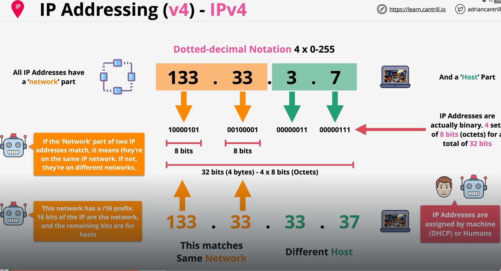
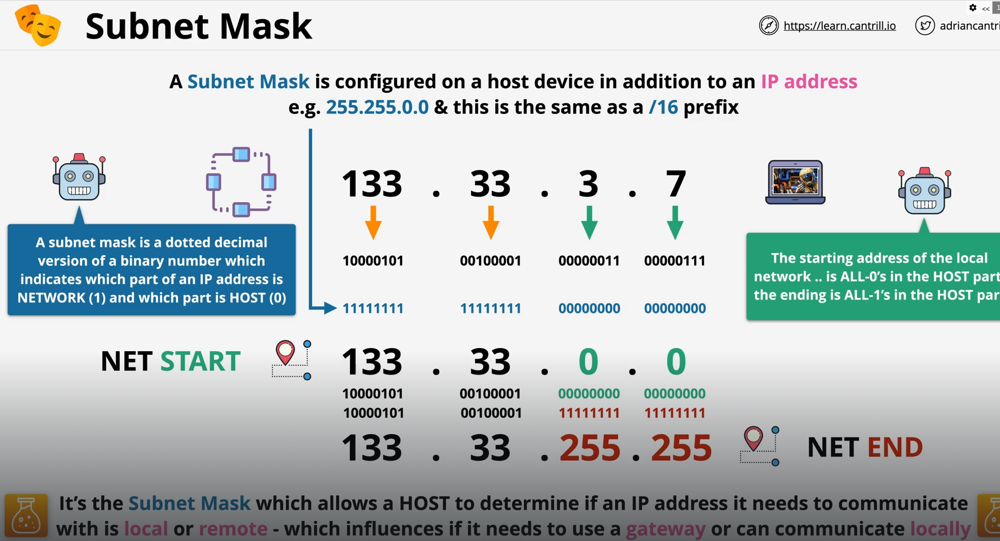
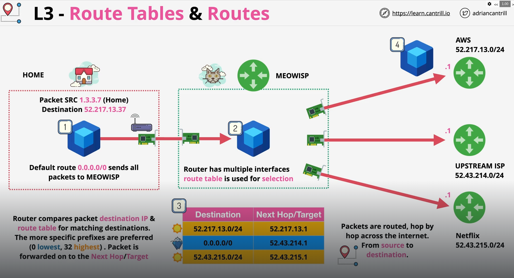
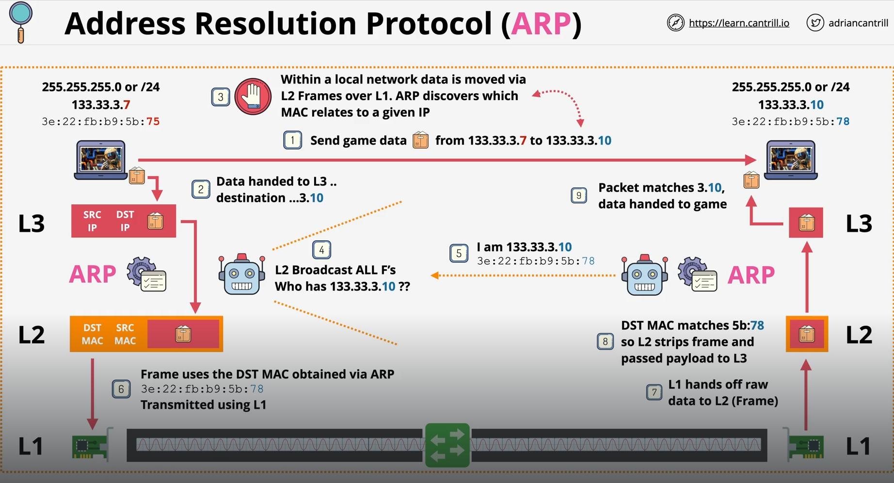
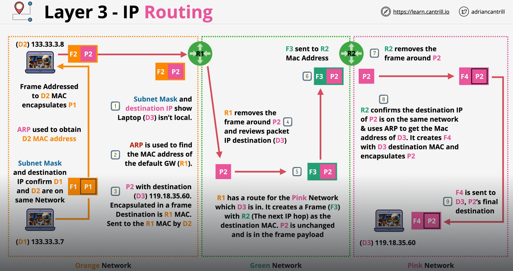

# Layer 3

## Layer 3 Protocols

- **IP**: Internet Protocol, the most common Layer 3 protocol. It provides logical addressing (IP addresses) and routing of packets across networks.
- **ICMP**: Internet Control Message Protocol, used for error messages and operational information (e.g., ping).
- **ARP**: Address Resolution Protocol, used to map IP addresses to

### Different IP Protocols

- **IPv4**: The most widely used version of IP, using 32-bit addresses.
- **IPv6**: The newer version of IP, using 128-bit addresses to accommodate the growing number of devices on the internet.

### 🛑 Layer 2 frame header gets dropped and recreated at every hop, while the Layer 3 packet header stays mostly intact.







---

## Address Resolution Protocol (ARP)



When a device wants to send data, it knows the destination IP (Layer 3), but to actually deliver the frame on the local network it needs the destination MAC address (Layer 2). ARP resolves this gap.

- 🛑 ARP only works within the same subnet. When PC A wants to reach a device on another network, it sends an ARP request for the router's MAC address (default gateway), not the remote device. The router then handles getting the packet to the other network — using its own ARP for the next hop.

- 🛑 Every physical port on a router usually has its own unique MAC address.

---

- D - Laptops
- P - Packet
- F - Frame
- R - Router

1. D1 ----> D2
2. D2 ----> D3



---

## How Layer 3 Solves Layer 2's Limitations

---

### Problem 1 — No Inter-Network Communication

**Layer 2:** Switch can only deliver frames within the same LAN. Cannot reach other networks.

**Layer 3 fix → Routing + IP Addresses**

Layer 3 introduces **routers** — devices that connect multiple networks together. When PC A wants to reach PC C on a different network:

```
PC A (192.168.1.10)                        PC C (10.0.0.5)
       │                                          │
    Switch                                     Switch
       │                                          │
       └──────────── Router ────────────────────┘
                   (Layer 3)
```

The router:

1. Receives the packet from PC A
2. Reads the **destination IP** (10.0.0.5)
3. Looks up its **routing table** to find the best path
4. Forwards the packet toward PC C's network

```
Router Routing Table:
Destination       Gateway          Interface
192.168.1.0/24   directly conn.   eth0
10.0.0.0/8       directly conn.   eth1
0.0.0.0/0        203.0.113.1      eth2   ← default route (internet)
```

Layer 2 could only deliver **within** a network. Layer 3 can deliver **between** any networks — including across the entire internet.

---

### Problem 2 — No Logical Addressing

**Layer 2:** MAC addresses are flat, hardware-burned, tell you nothing about location or organization.

**Layer 3 fix → Hierarchical IP Addressing + Subnetting**

IP addresses are **structured and meaningful** — every part tells you something:

```
192  .  168  .   1   .  10
 │        │       │      │
 └────────┘       │      └── Host (which device)
  Network class   └───────── Subnet (which group)
```

**Subnetting** lets you divide networks logically:

```
192.168.1.0/24  → Sales department     (256 hosts)
192.168.2.0/24  → Engineering          (256 hosts)
192.168.3.0/24  → Management           (256 hosts)
10.0.0.0/8      → Data center          (16M hosts)
```

This gives you:

| Capability         | MAC (Layer 2)    | IP (Layer 3)                |
| ------------------ | ---------------- | --------------------------- |
| Tells you location | ✗ No             | ✓ Yes — network + subnet    |
| Can be organized   | ✗ No             | ✓ Yes — subnets, CIDR       |
| Can be summarized  | ✗ No             | ✓ Yes — route aggregation   |
| Scales to internet | ✗ No             | ✓ Yes — billions of devices |
| Assigned logically | ✗ No (burned in) | ✓ Yes — DHCP or static      |

**Route aggregation** — a key power of IP:

```
Instead of advertising:
  192.168.1.0/24
  192.168.2.0/24
  192.168.3.0/24
  192.168.4.0/24

A router can advertise just ONE summary route:
  192.168.0.0/22   ← covers all four above
```

This keeps the internet's routing tables manageable — impossible with flat MAC addresses.

---

## Limitations of Layer 3 — Network Layer

Layer 3 solved inter-network routing and logical addressing, but it introduced its own limitations:

---

### 1. No Reliable Delivery

Layer 3 (IP) is **best-effort** — it makes no guarantees that a packet will actually arrive. Packets can be:

- **Lost** — dropped by a congested router
- **Duplicated** — sent twice due to routing issues
- **Corrupted** — IP checksum only covers the header, not the data
- **Silently discarded** — no notification sent back to sender

```
Sender → [Packet] → Router → [Packet] → ???
                                         ↑
                              Layer 3 doesn't know
                              or care if it arrived
```

There is no acknowledgement, no retransmission, no guarantee. That's entirely left to **Layer 4 (TCP)**.

### 2. No Ordering of Packets

IP packets travel **independently** — each one may take a completely different route:

```
Packet 1 → Router A → Router C → Destination  (arrives 3rd)
Packet 2 → Router A → Router B → Destination  (arrives 1st)
Packet 3 → Router B → Router D → Destination  (arrives 2nd)
```

They arrive **out of order** and Layer 3 has no mechanism to reorder them. Again, **Layer 4 (TCP)** handles sequencing with sequence numbers.

### 8. No Port / Application Awareness

Layer 3 only knows about **devices** (IP addresses) — it has no idea which **application** on that device the data is meant for. One device runs dozens of apps simultaneously:

```
192.168.1.10 is running:
  - Chrome (web browsing)
  - Zoom (video call)
  - Spotify (music)
  - WhatsApp (messaging)
```

Layer 3 delivers to the device but has no way to direct data to the right application. **Layer 4** solves this with **port numbers**.

---
